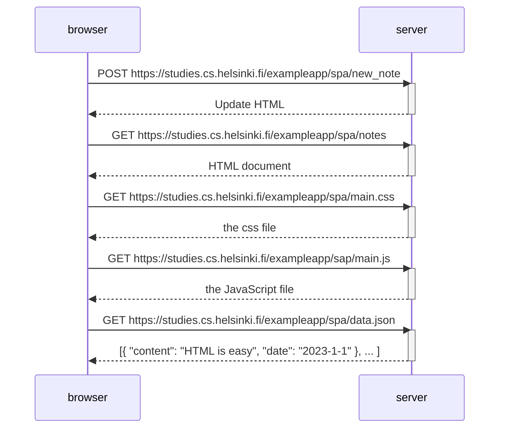

```mermaid
sequenceDiagram
  participant browser
  participant server

  browser->>server: POST https://studies.cs.helsinki.fi/exampleapp/spa/new_note
  activate server
  server-->>browser: Update HTML
  deactivate server

  browser->>server: GET https://studies.cs.helsinki.fi/exampleapp/spa/notes
  activate server
  server-->>browser: HTML document
  deactivate server

  browser->>server: GET https://studies.cs.helsinki.fi/exampleapp/spa/main.css
  activate server
  server-->>browser: the css file
  deactivate server

  browser->>server: GET https://studies.cs.helsinki.fi/exampleapp/sap/main.js
  activate server
  server-->>browser: the JavaScript file
  deactivate server

  browser->>server: GET https://studies.cs.helsinki.fi/exampleapp/spa/data.json
  activate server
  server-->>browser: [{ "content": "HTML is easy", "date": "2023-1-1" }, ... ]
  deactivate server
```
